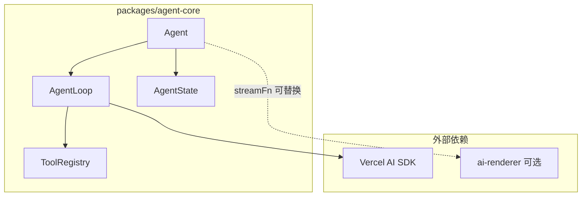

# Agent 框架子项目实现计划

## 一、架构概览




**核心关系**：Agent = 循环 + 状态 + 工具执行 + Steering/Follow-up/错误处理。`streamFn` 可对接 Vercel AI SDK 或自定义（如 ai-renderer 的 UI 生成）。

---

## 二、包结构

```
packages/agent-core/
├── package.json
├── src/
│   ├── index.ts           # 导出入口
│   ├── types.ts           # AgentTool, AgentEvent, AgentConfig, AgentMessage 等
│   ├── agent.ts           # Agent 类：状态、steering/follow-up 队列、subscribe
│   ├── loop.ts            # runLoop / streamAssistantResponse / executeToolCalls
│   ├── transform.ts       # AgentMessage[] → ModelMessage[]（convertToLlm）
│   └── default-stream.ts  # 默认 streamFn（基于 streamText）
```

---

## 三、类型设计（types.ts）


| 类型                | 用途                                                               |
| ----------------- | ---------------------------------------------------------------- |
| `AgentMessage`    | 统一消息格式：`{ role, content, toolCallId?, toolName?, isError? }`     |
| `AgentTool`       | 工具定义：`{ description, parameters, execute }`，与 AI SDK `tool()` 兼容 |
| `AgentEvent`      | 事件：`message`、`tool-call`、`tool-result`、`error`、`finish`          |
| `AgentConfig`     | 配置：`streamFn`、`tools`、`systemPrompt`、`model`、`maxSteps`          |
| `AgentLoopConfig` | 循环配置：`getSteeringMessages`、`getFollowUpMessages`、`abortSignal`   |


---

## 四、核心模块

### 1. Agent 类（agent.ts）

- **状态**：`messages: AgentMessage[]`、`systemPrompt`、`tools`、`model`
- **队列**：`steeringQueue`、`followUpQueue`（用户输入时根据时机入队）
- **方法**：`send(userInput)`、`abort()`、`continue()`（从当前状态重试）
- **事件**：`subscribe(callback)` 发出 `AgentEvent`

### 2. AgentLoop（loop.ts）

参考 [agent-start.md](agent-start.md) 和 [agent-steering-followUp-Error.md](agent-steering-followUp-Error.md)：

```text
外层循环（处理 follow-up）:
  while (有 follow-up 或首轮):
    messages += followUpQueue 中的消息
    
  内层循环（处理 tool calls + steering）:
    while (true):
      1. 调用 streamFn(messages, tools) → assistant 消息
      2. 若有 tool call:
         for each toolCall:
           执行工具
           每个工具执行后: 若有 steering → 跳过剩余工具，break 内层
           追加 tool result（含 isError 支持）
         continue 内层
      3. 若无 tool call:
         if 有 follow-up: messages += followUp, continue 外层
         else: break 全部
```

### 3. 消息转换（transform.ts）

- `AgentMessage[]` → `ModelMessage[]`（AI SDK 格式）
- 支持 `role: 'tool'` 且 `isError: true` 的 tool result 格式

### 4. 默认 streamFn（default-stream.ts）

- 使用 `streamText` + `tool()`，**不传 execute**，由 loop 手动执行
- 返回 `{ fullStream, response, toolCalls, finishReason }` 供 loop 消费

---

## 五、Steering / Follow-up 实现


| 概念            | 实现                                                                                                                                       |
| ------------- | ---------------------------------------------------------------------------------------------------------------------------------------- |
| **Steering**  | 每个工具执行后调用 `getSteeringMessages()`；若有新 user 消息，剩余 tool calls 返回 "Skipped due to queued user message"，将 steering 消息加入 `messages`，进入下一轮 LLM |
| **Follow-up** | 仅在「无 tool call 且无 steering」时调用 `getFollowUpMessages()`；若有，加入 `messages`，继续外层循环                                                           |
| **错误处理**      | 工具 `throw` 时构造 `{ isError: true, output: error.message }` 的 tool result；`abortSignal` 取消时 `stopReason: "aborted"`                        |


---

## 六、依赖与对接

- **依赖**：`ai`、`zod`（与 ai-renderer 一致），可选 `@ai-sdk/deepseek` 作为默认 provider
- **对接 ai-renderer**：通过 `streamFn` 注入，可将 `AIClient.streamUI` 包装为符合 `streamFn` 签名的函数，用于 UI 生成场景（此时 tools 可为空）

---

## 七、文件清单与关键代码点


| 文件                                                                                     | 关键内容                                                  |
| -------------------------------------------------------------------------------------- | ----------------------------------------------------- |
| [packages/agent-core/package.json](packages/agent-core/package.json)                   | `"@inuyasha/agent-core"`，依赖 `ai`、`zod`                |
| [packages/agent-core/src/types.ts](packages/agent-core/src/types.ts)                   | `AgentMessage`、`AgentTool`、`AgentEvent`、`AgentConfig` |
| [packages/agent-core/src/transform.ts](packages/agent-core/src/transform.ts)           | `convertToModelMessages(agentMessages)`               |
| [packages/agent-core/src/loop.ts](packages/agent-core/src/loop.ts)                     | `runLoop`、`executeToolCalls`、steering 检测、follow-up 检测 |
| [packages/agent-core/src/agent.ts](packages/agent-core/src/agent.ts)                   | `Agent` 类、`send`、`abort`、`continue`、`subscribe`       |
| [packages/agent-core/src/default-stream.ts](packages/agent-core/src/default-stream.ts) | 基于 `streamText` 的默认 `streamFn`                        |
| [packages/agent-core/src/index.ts](packages/agent-core/src/index.ts)                   | 导出 `Agent`、类型、工具函数                                    |


---

## 八、与 pi-agent-core 的对应关系


| pi-agent-core                    | agent-core 实现                            |
| -------------------------------- | ---------------------------------------- |
| `agent-loop.ts` runLoop          | `loop.ts` runLoop                        |
| `agent-loop.ts` executeToolCalls | `loop.ts` executeToolCalls               |
| `agent.ts` Agent 类               | `agent.ts` Agent 类                       |
| steering 队列                      | `getSteeringMessages` 回调，每工具执行后检查        |
| follow-up 队列                     | `getFollowUpMessages` 回调，无 tool call 时检查 |
| `isError: true` tool result      | 工具 throw 时构造                             |


---

## 九、实施步骤

1. 创建 `packages/agent-core` 目录和 `package.json`
2. 实现 `types.ts`（AgentMessage、AgentTool、AgentEvent、AgentConfig）
3. 实现 `transform.ts`（消息格式转换）
4. 实现 `default-stream.ts`（基于 streamText 的 streamFn）
5. 实现 `loop.ts`（runLoop、executeToolCalls、steering/follow-up 逻辑）
6. 实现 `agent.ts`（Agent 类、队列、subscribe）
7. 编写 `index.ts` 导出
8. 在根 `package.json` 或 workspace 中注册新包（如需要）

